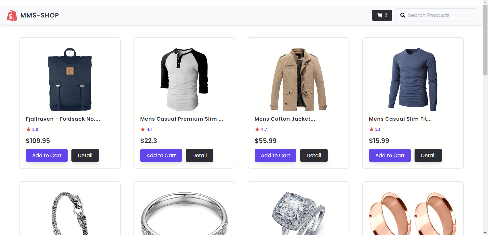

#  MMS-Shop 

## Table of contents

- [Overview](#overview)
  - [Screenshot](#screenshot)
  - [Links](#links)
- [My process](#my-process)
  - [Built with](#built-with)
  - [What I learned](#what-i-learned)

## Overview

This is a solution to mms-shop that I code along with [MMSIT](https://www.facebook.com/mmsoss) instructor using fake store api.

### Screenshot

### Links

- Live Site URL: [Deploy on nelify](https://dashing-sawine-25edf3.netlify.app/)

## My process

### Built with

- React

### What I learned

- useReducer hook
- useContext hook & 
- basic card management system

